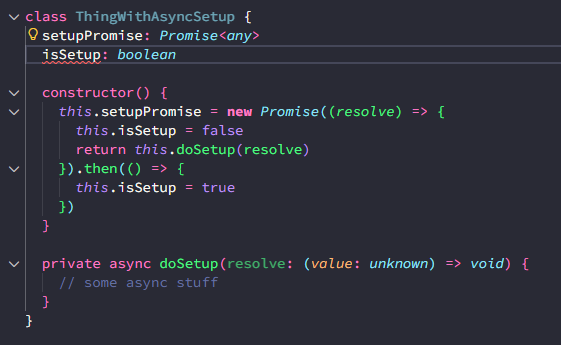
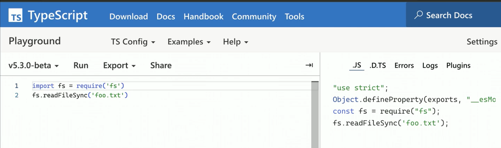

# intermediate typescript

## intro quiz - overview / review

**declaration merging** combines multiple declarations withyt e same name into a single definition

**unit type** a type that can only hold exactly one value
`infer` keyword purpose: extract a type aparameter our of another type within a conditional type's condition  

**top types** - can accept any value  

**mapped types** - transform types by creating new interfaces witht he same keys but different value types  

**variance** over type parameters --> the way types behave in relation to their type parameters -- includes: covariance, contravariance, bivariance, and invariance  

## declaration merging

* describes how various declarations stack on top of each other to form importable and exportable symbols
* alt: * when a single identifier (importable or exportable item with a name) has multiple things stacked on top of it such as a function, interface, and namespaces all sharing the same name

### identifiers

``` TypeScript
interface Fruit {
           
interface Fruit
  name: string
  mass: number
  color: string
}
 
const banana: Fruit = {
        
const banana: Fruit
  name: "banana",
  color: "yellow",
  mass: 183,
}

// both of these things are exportable
export { banana, Fruit }

```

* what if there were MULTIPLE declarations named Fruit?  
* what is an identifier?  
* why wouldn't i make a class called Fruit??  

**Identifiers Quiz**
how many distinct slots can an identifier have in TypeAscript thorugh declaration merging?  
*three: values, types, namespaces*  

How can you test whether an identifier has a value on it in TypeScript  
*Try to use it on the right-hand side of a variable assignment*  

What is unique about testing whether an identifier has a namespace in TypeScript?  
*There is no expression that will only work if something is a namespace; it must be verified by hovering over it*  

### namespaces

What's the point of `namespace`?  

* can be used as a type
* can't be used as a value
* jQuery example

### classes

* we benefit from declaration merging when we create classes
  * play on prototypal inheritance ??
* if you can assign it to a value it is *at least* a value

What two things does a TypeScript class declaration merge together?  
*A type for the instance and a value for the class constructor*

Why does TypeScript infer [1, 2, 3] as number[] instead of a specific tuple type?  
*Because arrays are mutable and TypeScript makes practical assumptions about their use*

What is the difference between TypeScript's readonly modifier and Object.freeze()?  
*readonly is a compile-time check that's stripped away, while Object.freeze() actually prevents runtime modifications*

How can you get TypeScript to infer more specific literal types for an object?  
*Use as const to make TypeScript infer as if it were a const declaration with readonly properties*

What is a simple test to determine if something is a value in TypeScript?  
*Try assigning it to a variable - if it works, there's at least a value present*

## top & bottom types

### top types

A top type (symbol: `⊤`) is a type that describes any possible value allowed by the system.

`any` allows typescript to play by regular javascript rules  
`unknown` typesx values cannot be used without applying a type guard

What is the key difference between the any type and the unknown type in TypeScript?  
*`unknown` requires type narrowing before use, while `any` disables type checking*

Why is the any type appropriate for console.log()?  
*Because it needs to accept and serialize any value that can be created in JavaScript*

What must you do before using a variable of type unknown in TypeScript?  
*You must use type guards to narrow down the type*
> covered type-guards in enterprise ts course @ [./packages/chat/src/type-guards.ts](./packages/chat/src/type-guards.ts)

What happens when you assign different types of values to a variable declared as any?  
*TypeScript allows all assignments without type checking*

### pratical uses of top types

``` JSON
// tsconfig.json
{
    // ...
    "useUnknownInCatchVariables": true,

    // 
}
```

* pay a price at runtime with type-guards
* unknown is good for API / schema errors
* an "opaque" value
* type-guards when talking to APIs that are NOT SaaS and won't know that it is changed -- makes errors easier to tracer

**Quiz**
What TypeScript compiler setting automatically types catch block variables as unknown?  
*UseUnknownInCatchVariables*

Why is it recommended to type catch block error variables as unknown instead of any?  
*It prevents assuming the error is a proper Error object before checking, since throwables could be strings or other objects*

When is it most appropriate to use typeguards for API responses?  
*When working with external APIs that you don't control and may change without notice*

What is an appropriate use case for the unknown type when passing values through code?  
*When treating a value as opaque that passes through library code and returns to the consumer unaltered*

What is the trade-off when using typeguards to validate API responses at runtime?  
*You pay a runtime cost but get more actionable errors when the API shape doesn't match expectations*

### objects & Empty Objects

almost top types - object & {}  
interfaces represent object types which is DIFFERENT than the type called object

null is not assignable to Empty Object

> what is the point of a non nullable?  

**QUIZ**  
What does the `object` type represent in TypeScript?  
*The set of all possible values except for primitives*  

Which of the following values are NOT accepted by the `object` type?  
*`number`, `string`, `boolean`, `null`, `undefined`, `symbol`, and `bigint`*

What is the empty `object` type `{}` allowed to accept?  
*All possible values except `null` and `undefined`*

How can you remove `null` and `undefined` from a union type like `string | number | null | undefined`?
*Use the `NonNullable` utility type or intersect with `{}`*

When strict `null` checks are disabled in tsconfig, how does `null` behave with the object type?  
*`null` is allowed as part of any type created*

### bottom types

if the types represent what will be at runtime - you should `never` get here

* I think I've handle every possible thing that could be
* exhaustive condition -- unreachable errors -- helpful for tracing in observalibilty tools/logging

### unit types

you can create a unit type with a literal type
a unit type is ONE thing

voids can accepts `void` and `undefined`

## nullish values

### null nad non-null assertions

`null` has to be explicitly set - nothing is here  
someone has filled in this field and it's value is NOTHING

versus `undefined` is the absence of a value - the value has not been defined

non-null assertion operator: `!`

* tells TS to ignore the possibility that this value could be `null` or `undefined`
* useful in tests, recommends against in library or application code because it will NOT throw an error

### definite assignment assertion

turn on `strictPropertyInitialization` in tsconfig



* promise executor (callback) is invoked synchronously
* typescript does not know this becaue it is placed within the constructor
* we are telling typescript `!` that we are going to take care of assigning this type
  * better practice to use a type-guard in lib/app in production

`declare` in ambient type information ????

* what is ambient type information?

### optional chaining

``` TypeScript
function getLastPayment2(data: ResponseData): number | undefined {
  return data?.customer?.lastInvoice?.lastPayment?.amount
}
//if at any point something is undefined, it will evaluate to undefined
```

QUIZ

**What does the optional chaining operator (?.) evaluate to if any property in the chain is undefined or null?**  
`undefined`

**What is the main difference between the nullish coalescing operator (??) and the logical OR operator (||)?**  
*The logical OR operator checks for truthy/falsy values, while nullish coalescing only checks for null or undefined*

**Consider this code:**

``` TypeScript
const volume = config.volume || 50;
```

**What problem occurs when config.volume is set to 0?**
*The value 0 fails the truthy check and gets replaced with 50, even though 0 is a valid volume value*  

**Which operator allows safe drilling into nested objects without throwing errors if intermediate properties are undefined?**  
*Optional chaining (?.)*

**Which of the following values would be treated differently by the logical OR operator (||) compared to the nullish coalescing operator (??)?**  
*0, empty string, and Boolean false*

## modules & CJS interop

### es modules imports and exports

* default export are the whole file  as module - can change you name the import

```TypeScript
export { lemon, lime } from './citrus' // re-export
export * as berries from './berries' // re-export entire module as a single namespace
```

* there is a bunch of stuff in the berries file, and I want it exported as berries
* what is the benefit of this?

#### import types

``` TypeScript
import type { Strawberry } from './berries/strawberry'

let z: Strawberry = { color: 'red' }
new Strawberry()
```

* can import types
* to use as type ONLY --> `import type { Strawberry } from '...'`
* tells your compiler that it is a type only input and it is ok to drop that import because we don't need type strawberry at runtime only for type checking

### commonjs interop

* example - `module.exports = {...}`
* `import * as bananaNamespace from './banana'` || `import { Banana } form '.banana'`
  * you can export all kinds of modules on that common js `module.exports` object

``` TypeScript
class Melon {
    cutIntoSlices() { }
}

module.exports = Melon

\\\\\\\\\\\\\\\\\

// ? import as a single thing (rare)
import * as melonNamespace from './melon'
// ? special ts import
import Melon = require('./melon') // this only works in ts if you DON'T want to change your compile type

const melon = new Melon()
melon.cutIntoSlices()
```

* esmodule interop flag --> will trea as a default export (which it is *technically* not)
  * if you enforce in a library - you force all users of the library to turn this onc
* *almost* a cjs import and should be able to adjust compiler settings to work with this syntax
* preference for ecmascript imports whereer possible, but this `melon = require` syntax is great for flexibility
* NOTE: import * as f from 'fs' required a LOT more behind the scenes code to compile to js per ts playground
  


### native ES modules

package.js - type property

* `"module"` indicates that `.js` files should be run as ES modules
* `"commonjs"` indicates that `.js` files should be run as CommonJS

* importing `.cjs` files --> need to add the file extension
* top level await is only available in es modules!

### importing non-typescript files

* global.d.ts is or highest level adjustments for how TS should treat certain things

``` TypeScript
declare module '*.png' {
    const imgUrl: string
    export default imgUrl
}
```

* declaring and sayin treat this as a string - this file can ONLY contain types
  * it will "compile away" in the build
* ambient type information

**QUIZ**
**What is the purpose of a global.d.ts file in TypeScript?**  
*To place ambient type information and make high-level adjustments to how TypeScript understands types*

**When importing a PNG file in TypeScript with a bundler like webpack, what error typically occurs without proper type declarations?**  
*TypeScript cannot find a corresponding .ts file for the PNG import*

**In a module declaration within a global.d.ts file, what must you do to make types available to consumers of that module?**  
*Explicitly export the types or values from the module declaration*

**What types of content are allowed in a .d.ts declaration file?**  
*Only type declarations, not actual values*

**When creating a module declaration for non-code files like images, what can the module name pattern include?**  
*Patterns matching file extensions, URLs, or any string pattern*
